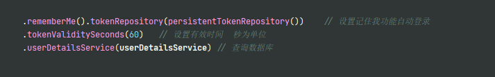

# 注解权限使用


1. @Secured 判断是否具有角色 注意的是需要匹配的字符串前面需要添加前缀 ”ROLE_“  数据库角色也要带上"ROLE_"前缀
```java
    @EnableGlobalMethodSecurity(prePostEnabled = true)  //在启动类上加上注解启动开关
    @Secured({"ROLE_admin","ROLE_user"})   // 在controller方法上设置注解
```
2. @PreAuthorize  在方法执行前校验角色

```java
    @EnableGlobalMethodSecurity(prePostEnabled = true) // 在注解启动类上开启注解
    @PreAuthorize("hasAnyAuthority('admin,user')")  // 使用方法
```
3. @PostAuthorize 在方法执行之后调用查询权限

 中间的方法会被执行
```java
    @EnableGlobalMethodSecurity(prePostEnabled = true) // 在注解启动类上开启注解
    @PostAuthorize("hasAnyAuthority('admin,user')") // 使用方法
```

4. @PostFilter // 对方法返回数据进行过滤
    

5. @PreFilter   // 对方法的参数进行过滤

# 记住我功能实现
实现原理


spring security中的封装流程


步骤
1. 创建数据库表
    源码中会自己创建,也可以自己创建
2. 配置类中注入数据源，配置操作数据库对象


3. 配置类设置设置记住我自动登录及其有效时长


4. 前端设置
```html
<input type="checkbox" name="remember-me"/> 自动登录  // name 必须为remember-me
```
<input type="checkbox" name="remember-me"/> 自动登录

5. 效果
自动创建了表


# csrf 功能  4.0之后默认开启

跨站请求伪造

```java
.csrf().disable() // 关闭csrf防护   
```