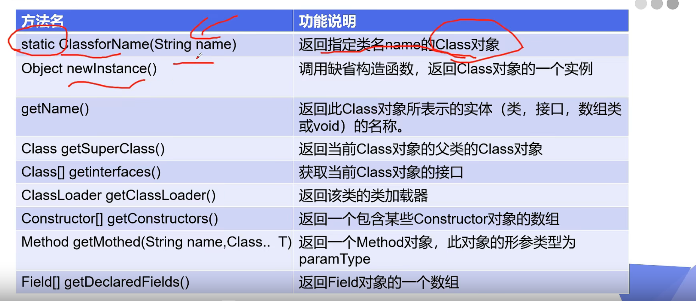

# 反射学习

1. 一个类在内存中只有一个Class对象
2. 一个类被加载后，类的整个结构都会被封装在Class对象中
3. 常用方法


### 获取Class对象的方法

1. 已知具体的类，通过类的class属性获取,该方法最为安全可靠,程序性能最高

```java
Class<Reflection> aclass = Reflection.class;
```
2. 已知某个类的实例,调用该实例的getClass()方法获取Class对象
```java
Reflection reflection = new Reflection();
Class<? extends Reflection> aClass = reflection.getClass();
```
3. 已知一个类的全类名获取,可能会抛出ClassNotFoundException异常
```java
Class<?> aClass = Class.forName("com.example.reflection.Reflection");
```
4.方法使用注意
+ 获取public的方法或者属性 父类继承的可以获取
```java
        Method[] methods = studentClass.getMethods();
        Method method = studentClass.getMethod("test");
        Field[] fields = studentClass.getFields();
        Field name = studentClass.getField("name");
```
+ 获取全部的方法或者属性 父类继承的不能获取
```java
        Method[] methods = studentClass.getDeclaredMethods();
        Method method = studentClass.getDeclaredMethod("test");
        Field[] fields = studentClass.getDeclaredFields();
        Field name = studentClass.getDeclaredField("name");
```

5. 根据反射构造方法创建对象
```java
// 通过构造器创造对象
            // 无参构造器
        Student student1 = studentClass.newInstance();

            // 有参构造器
        Constructor<Student> constructor = studentClass.getDeclaredConstructor(String.class);

        // 安全检测是否关闭 破坏私有权限 （破坏 private 权限）
        constructor.setAccessible(true);  // true为关闭 false为开启（默认开启false）
        // 传递有参构造器参数
        Student zxysb = constructor.newInstance("zxy");
```
6. 根据反射调用方法
```java
Method getAge = studentClass.getDeclaredMethod("setAge", String.class);
        getAge.setAccessible(true);  // 也可以把私有方法调用修改        
        // invoke() 激活 （要操作的对象，多个方法的值）
        getAge.invoke(zxysb,"10000");
        System.out.println(zxysb.getAge());
```
7. 根据反射操作属性
```java
// 操作属性
        Field studentName = studentClass.getDeclaredField("name");
        studentName.setAccessible(true);   // 关闭私有
        studentName.set(student,"傻逼");
```

* 注意事项
    1. setAccessible是基本都有的，关闭安全检测（破坏 private 权限 之类的）true为关闭 false为开启（默认开启false）
    2. getDeclaredMethods 之类的不能得到父类继承的属性或者方法是获取到所有的方法或者属性
    3. getMethod 之类的只能获取到public的方法，但是可以获取到父类的方法
    4. 方法的调用通过激活invoke()方法,具体使用在第6点
    5. 