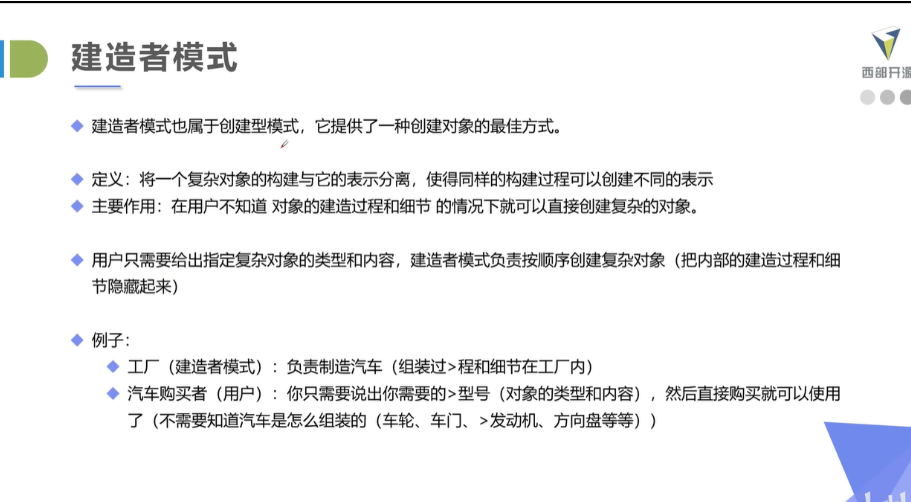
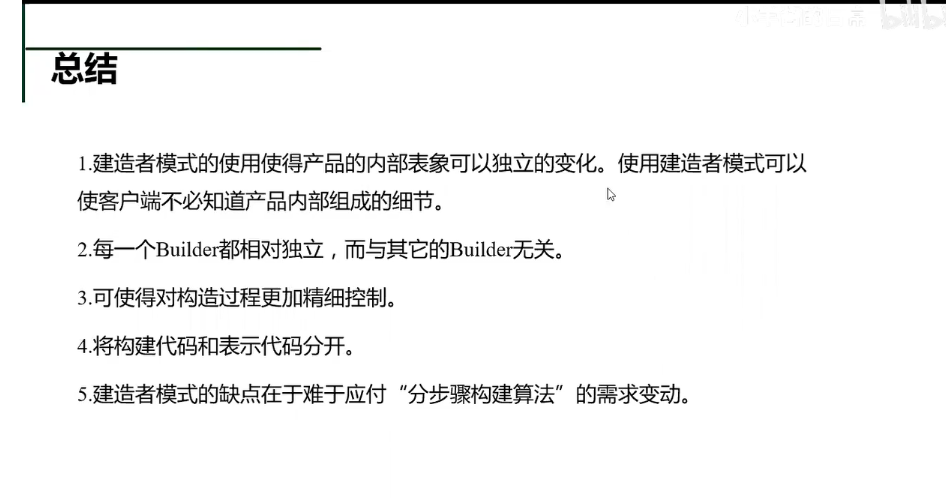

# 工厂模式

### 简单工厂

    不符合设计要求,但是常用,判断类型
    新添产品种类会改动原来代码

### 工厂方法模式
    
    写一个接口方法,将其对应的产品生成一个工厂实现最大的接口，然后就可以掉对应的厂家的工厂方法生成产品
    新添产品种类不会改动原来代码

### 抽想工厂模式

    建造一个大工厂,让其生成别的工厂

    实现代码

# 建造者模式

    侧重于构建复杂的产品，有指挥者只会产品的构建  一步步走

# 原型模式

